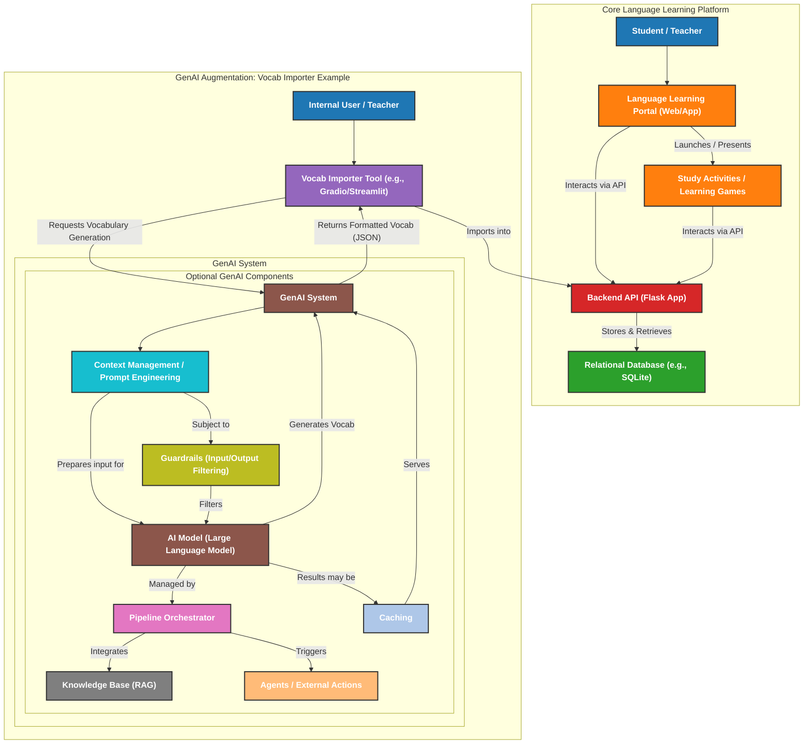

# prequesties

## Explanation of the Conceptual Diagram: ##
This diagram is divided into two main subgraphs to represent the existing Language Learning Platform and how a new Generative AI component (exemplified by a "Vocab Importer") would integrate into it.
### 1. Core Language Learning Platform: ###
    ◦ User (Student / Teacher): Represents the end-users interacting with the system.
    ◦ Language Learning Portal (Web/App): This is the front-end React application that users interact with.
    ◦ Backend API (Flask App): The back-end Flask application that handles requests from the front-end. All interactions with the database typically go through this API.
    ◦ Relational Database (e.g., SQLite): The SQLite database used to store application data, such as words and word groups.
    ◦ Study Activities / Learning Games: These are the various learning tools and games launched or presented by the front-end portal, such as writing practice apps, text adventures, visual novels, and sentence constructors. They interact with the Backend API for data.
### 2. GenAI Augmentation: Vocab Importer Example: ###
    ◦ Internal User / Teacher: Represents an administrator or teacher who would use the Vocab Importer to populate the application with new content.
    ◦ Vocab Importer Tool (e.g., Gradio/Streamlit): This is a new interface-facing tool designed to generate and import vocabulary. It will initiate requests to the GenAI System.
    ◦ GenAI System: This subgraph details the conceptual components of a generative AI workflow, as outlined by Rola.
        ▪ Context Management / Prompt Engineering: This component is responsible for formatting the input provided to the AI model, enriching it with context or specific instructions.
        ▪ AI Model (Large Language Model - LLM): This is the core generative model (e.g., a foundation model from a provider like OpenAI or Anthropic) that generates new content, in this case, vocabulary.
        ▪ Optional GenAI Components: These are additional conceptual layers that can be added to enhance the GenAI system, illustrating the flexibility in choosing complexity for deployment ("we show you choose"):
            • Guardrails (Input/Output Filtering): These act as fencing mechanisms to control what information leaves your company and to filter potentially unsafe or biased output from the model. They can filter both input to and output from the LLM.
            • Pipeline Orchestrator: A system that chains multiple processes within the GenAI workflow, managing the flow from user input to model response and potentially incorporating other tools or models. It helps with tracing and state management.
            • Knowledge Base (RAG): Represents a retrieval augmented generation (RAG) pattern, where additional, specific knowledge (e.g., company data) is retrieved from a database to enhance the context provided to the LLM.
            • Agents / External Actions: Software systems that can execute actions on the model's behalf outside the core generation, such as updating orders or sending emails. This gives the model "agency".
            • Caching: A mechanism to reduce latency and cost by storing frequently accessed model responses or data retrievals.
    ◦ Vocab Importer returns Formatted Vocab (JSON): The generated vocabulary, after passing through the GenAI system, is sent back to the Vocab Importer.
    ◦ Vocab Importer Imports into Backend: Finally, the formatted vocabulary is sent via the Backend API to be stored in the Relational Database, making it available for the Language Learning Portal.
This diagram represents the high-level architectural design considerations for integrating Generative AI into the Lang Portal, providing a clear visual for understanding the system's conceptual flow and its potential expansion.
