# prequesties

```mermaid
graph TD
  %% === Core Language Learning Platform === %%
  subgraph Core Language Learning Platform
    User["👨‍🎓 Student / Teacher"] --> FrontEnd["🖥️ Language Learning Portal<br>(React Frontend)"]
    FrontEnd -- "Interacts via API" --> BackEnd["🔁 Backend API<br>(Flask App)"]
    BackEnd -- "Stores & Retrieves" --> Database["🗄️ Relational Database<br>(SQLite)"]
    FrontEnd -- "Launches Activities" --> StudyActivities["🎮 Study Activities<br>(Games, Apps)"]
    StudyActivities -- "Interacts via API" --> BackEnd
  end

  %% === GenAI Augmentation === %%
  subgraph GenAI Augmentation: Vocab Importer
    InternalUser["👩‍🏫 Internal User / Teacher"] --> VocabImporter["🛠️ Vocab Importer Tool<br>(Gradio / Streamlit)"]
    VocabImporter -- "Requests Vocabulary" --> GenAISystem["🧠 GenAI System"]

    subgraph GenAI System
      GenAISystem --> ContextManagement["🧰 Context Management<br>/ Prompt Engineering"]
      ContextManagement -- "Prepares Input" --> LLM["🤖 AI Model<br>(LLM - GPT / Claude)"]
      LLM -- "Generates Vocab" --> GenAISystem

      %% === Optional GenAI Components === %%
      subgraph Optional GenAI Components
        GuardRails["🛡️ Guardrails<br>(Input/Output Filtering)"]
        PipelineOrchestrator["🧪 Pipeline Orchestrator"]
        KnowledgeBase["📚 Knowledge Base<br>(RAG)"]
        Agents["🦾 Agents<br>/ External Actions"]
        Caching["⚡ Caching"]

        ContextManagement -- "Subject to" --> GuardRails
        GuardRails -- "Filters" --> LLM
        LLM -- "Managed by" --> PipelineOrchestrator
        PipelineOrchestrator -- "Integrates" --> KnowledgeBase
        PipelineOrchestrator -- "Triggers" --> Agents
        LLM -- "Results may be" --> Caching
        Caching -- "Serves" --> GenAISystem
      end
    end

    GenAISystem -- "Returns Formatted Vocab<br>(JSON Format)" --> VocabImporter
    VocabImporter -- "Imports to DB via API" --> BackEnd
  end

  %% === Styling === %%
  style User fill:#1F77B4,stroke:#333,stroke-width:2px,color:#fff
  style FrontEnd fill:#FF7F0E,stroke:#333,stroke-width:2px,color:#fff
  style BackEnd fill:#D62728,stroke:#333,stroke-width:2px,color:#fff
  style Database fill:#2CA02C,stroke:#333,stroke-width:2px,color:#fff
  style StudyActivities fill:#FF7F0E,stroke:#333,stroke-width:2px,color:#fff

  style InternalUser fill:#1F77B4,stroke:#333,stroke-width:2px,color:#fff
  style VocabImporter fill:#9467BD,stroke:#333,stroke-width:2px,color:#fff
  style GenAISystem fill:#8C564B,stroke:#333,stroke-width:2px,color:#fff

  style ContextManagement fill:#17BECF,stroke:#333,stroke-width:2px,color:#fff
  style LLM fill:#8C564B,stroke:#333,stroke-width:2px,color:#fff

  style GuardRails fill:#BCBD23,stroke:#333,stroke-width:2px,color:#fff
  style PipelineOrchestrator fill:#E377C2,stroke:#333,stroke-width:2px,color:#fff
  style KnowledgeBase fill:#7F7F7F,stroke:#333,stroke-width:2px,color:#fff
  style Agents fill:#FFBB78,stroke:#333,stroke-width:2px,color:#000
  style Caching fill:#AEC7E8,stroke:#333,stroke-width:2px,color:#000

```

# 🧠 Conceptual Diagram Explanation: GenAI-Augmented Language Learning Platform

This document explains the **conceptual architecture** of a language learning platform integrated with a **Generative AI system** — specifically through a feature called **Vocab Importer**.

---

## 🌐 1. Core Language Learning Platform

This part represents the existing non-AI system. It includes the main web app, backend, database, and learning games:

- 👩‍🏫 **User (Student / Teacher):**  
  The primary users who interact with the system for learning or managing content.

- 🖥️ **Language Learning Portal (Web/App):**  
  A front-end **React** application that users engage with for vocabulary practice and activities.

- 🔁 **Backend API (Flask App):**  
  A **Flask-based** back-end system that handles data requests/responses between the front-end and the database.

- 🗃️ **Relational Database (SQLite):**  
  A lightweight local database where words, word groups, and user progress are stored.

- 🎮 **Study Activities / Learning Games:**  
  Fun and interactive tools that aid language learning, like:
  - ✍️ Writing Practice App
  - 🎮 Text Adventure Game
  - 📚 Visual Novel Reader
  - 🧱 Sentence Constructor  
  These tools fetch and submit data through the **Backend API**.

---

## 🤖 2. GenAI Augmentation: Vocab Importer Integration

This layer represents the **new Generative AI components** introduced to expand the capabilities of the platform.

### 🧑‍💼 Internal User (Teacher / Admin)
- A teacher or admin uses this tool to generate and upload new vocabulary content.

### 🛠️ Vocab Importer Tool (e.g., Gradio/Streamlit)
- An interface where the internal user types a topic (e.g., "kitchen vocabulary") to generate words.
- This request flows through a **Generative AI pipeline**.

---

### 🧠 GenAI System (Conceptual Workflow)

This is the **conceptual GenAI architecture** as outlined by expert Rola — visualizing how input flows through the GenAI model and returns structured content.

- 🧰 **Context Management / Prompt Engineering:**  
  Prepares the input prompt with relevant formatting, tone, and context before sending it to the LLM.

- 🧠 **AI Model (LLM - Large Language Model):**  
  The core generative engine — e.g., GPT from OpenAI or Claude from Anthropic — responsible for generating new vocabulary.

#### 🧩 Optional GenAI Components ("We Show You Choose")

These are optional layers that can be added for a more **production-grade GenAI system**:

- 🛡️ **Guardrails (Input/Output Filtering):**  
  Filters out sensitive or unsafe data either before sending to the LLM or after generation.

- 📦 **Pipeline Orchestrator:**  
  Controls and sequences all the components in the GenAI pipeline (prompt → model → response → action). Also handles:
  - Logging
  - State management
  - Multi-step flows

- 📚 **Knowledge Base (RAG - Retrieval-Augmented Generation):**  
  Fetches external context (e.g., company data) to be added to the prompt — improving the model’s accuracy.

- 🤖 **Agents / External Actions:**  
  Can act on behalf of the model — e.g., updating a DB, sending emails, or executing tasks.

- ⚡ **Caching:**  
  Stores commonly generated outputs or queries to reduce cost and improve response speed.

---

### 🔁 Flow Summary

1. ✍️ Internal User inputs a topic in **Vocab Importer** (e.g., "restaurant vocabulary")
2. ⚙️ Prompt is sent through the **GenAI System**
3. 🧠 LLM generates the **formatted vocabulary (JSON)**
4. 📩 Vocab Importer receives the result
5. 🔄 Sends it to **Backend API** for saving in the database
6. 📚 The **Language Learning Portal** can now access and display this new content

---

## 🧱 Visual Summary

This architecture explains how Generative AI fits seamlessly into an existing educational platform, providing a **scalable and modular design**:

